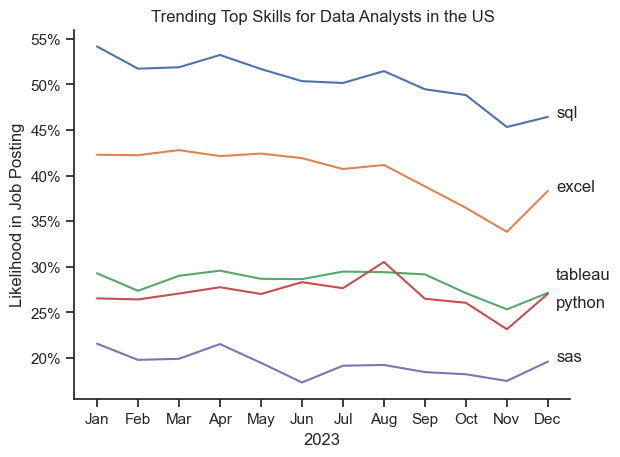
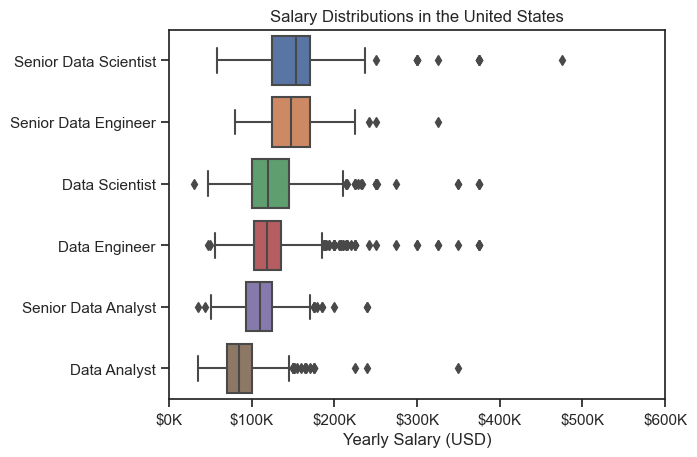
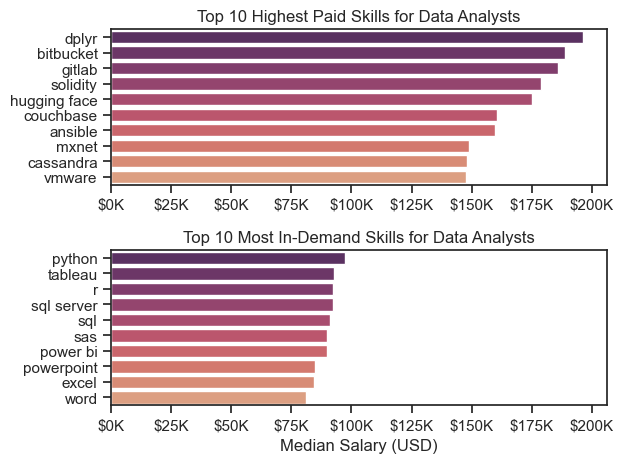

# Analysis

## What are the most demanded skills for the top 3 most popular data roles?

This analysis explores U.S. job postings to identify the most in-demand roles and the key skills employers are seeking. Using aggregated job posting data, I first determined the most frequently advertised positions, then examined the top five skills associated with each role.

By comparing skill frequencies across popular roles such as Data Analyst and Data Scientist, the analysis highlights which technical competencies are most valued in today’s job market-most notably Python, SQL, and Excel. These insights provide a data-driven perspective on hiring trends, helping to pinpoint the core skills that consistently appear in high-demand positions.

For detailed steps, you can view the notebook [here](3_Project/2_Skills_Demand.ipynb).

#### Visualise Data
```python
fig, ax = plt.subplots(len(job_titles), 1)

for i, job_title in enumerate(job_titles):
    df_plot = df_skills_pct[df_skills_pct['job_title_short']== job_title].head(5)
    sns.barplot(data=df_plot, x='skill_percent', y='job_skills', ax=ax[i], palette='flare_r')
    ax[i].set_title(job_title)
    ax[i].set_ylabel('')
    ax[i].set_xlabel('')
    ax[i].get_legend()
    ax[i].set_xlim(0,78)

    for n, v in enumerate(df_plot['skill_percent']):
        ax[i].text(v + 1, n, f'{v:.0f}%', va='center')
    
    if i != len(job_titles) - 1:
        ax[i].set_xticks([])

fig.suptitle('Likelihood of Skills Requested in US Job Postings', fontsize=15)
fig.tight_layout(h_pad=0.5)
plt.show()
```
### Results


### Insights

1. **SQL and Python dominate across all roles**
    - SQL appears in the top two skills for every role, confirming it as a universal requirement for data professionals.

    - Python is equally strong, it’s the top skill for Data Scientists (72%) and a core skill for Data Engineers (65%).

2. **Role-specific skill differences**

    - Data Analysts emphasize Excel and Tableau, reflecting a focus on reporting, visualization, and business-facing analytics.

    - Data Engineers show strong demand for AWS, Azure, and Spark; pointing to a focus on cloud infrastructure and large-scale data pipelines.

    - Data Scientists rely more heavily on R, SAS, and Tableau, which align with statistical modeling and analytical visualization.

3. **Shared foundation, diverging specializations**

    - The overlap in Python and SQL shows a shared technical foundation, but beyond that, each role specializes:

        - Analysts lean toward visualization tools.
        - Engineers toward cloud and big data platforms.
        - Scientists toward modeling and experimentation frameworks.

## How are in-demand skills trending for Data Analysts?

#### Visualise Data

``` python
df_plot = df_DA_US_percent.iloc[:, :5]
sns.lineplot(data=df_plot, dashes=False)
sns.set_theme(style='ticks')
sns.despine()

plt.title('Trending Top Skills for Data Analysts in the US')
plt.ylabel('Likelihood in Job Posting')
plt.xlabel('2023')
plt.legend().remove()

from matplotlib.ticker import PercentFormatter
ax = plt.gca()
ax.yaxis.set_major_formatter(PercentFormatter(decimals=0))


offsets = {
    'tableau': 1.5,
    'python': -1.5
} # need to manually otherwise these labels overlap

for i in range(5):
    label = df_plot.columns[i]
    y_pos = df_plot.iloc[-1, i] + offsets.get(label, 0)
    plt.text(11.2, y_pos, label)

```

### Results



### Insights

SQL and Excel remain foundational skills for Data Analysts throughout 2023, with SQL consistently dominating job requirements. Tableau and Python show stable demand, while SAS continues a gradual decline. Overall, the data reflects a shift toward widely used analytical tools (SQL, Python, Tableau) and away from legacy platforms.


## How well do Data Analysts jobs pay in comparison to other data roles?

### Salary Analysis for Data Roles

#### Visualise Data

```python
sns.boxplot(data=df_US_top_6, x='salary_year_avg', y='job_title_short', order= job_order)
sns.set_theme(style='ticks')


plt.title('Salary Distributions in the United States')
plt.xlabel('Yearly Salary (USD)')
plt.ylabel('')
plt.xlim(0, 600000)
ticks_x = plt.FuncFormatter(lambda y, pos: f'${int(y/1000)}K')
plt.gca().xaxis.set_major_formatter(ticks_x)
plt.show()

```

#### Results

*Box plot for salary distributions - top 6 data jobs titles*

#### Insights

- Senior roles (Data Scientist, Data Engineer) have the highest median salaries and the widest ranges, showing greater pay variability.

- Entry-level roles like Data Analyst have lower and more consistent salary distributions.

- Outliers across all roles suggest some professionals earn well above the typical range, likely due to location, experience, or company size.

- The clear gap between analyst and engineering/science roles highlights the premium placed on technical and modeling expertise.

Overall, the trend confirms a strong correlation between seniority and salary growth within data-related careers.


## What skills in Data Analyst pay the most? And which ones are more popular in DA roles?

### Highest Paid & Most Demanded Skills dor Data Analysts

#### Visualise Data

``` python

fig, ax = plt.subplots(2, 1)

sns.set_theme(style='ticks')

# Top 10 Highest Paid Skills for Data Analysts
sns.barplot(data=df_DA_top_pay, x='median', y=df_DA_top_pay.index, ax=ax[0], palette='flare_r')
ax[0].legend().remove()

ax[0].set_title('Top 10 Highest Paid Skills for Data Analysts')
ax[0].set_ylabel('')
ax[0].set_xlabel('')
ax[0].xaxis.set_major_formatter(plt.FuncFormatter(lambda x, _: f'${int(x/1000)}K'))


sns.barplot(data=df_DA_skills, x='median', y=df_DA_skills.index, ax=ax[1], palette='flare_r')
ax[1].legend().remove()

ax[1].set_title('Top 10 Most In-Demand Skills for Data Analysts')
ax[1].set_ylabel('')
ax[1].set_xlabel('')
ax[1].set_xlabel('Median Salary (USD)')
ax[1].set_xlim(ax[0].get_xlim())
ax[1].xaxis.set_major_formatter(plt.FuncFormatter(lambda x, _: f'${int(x/1000)}K'))

fig.tight_layout()

```

#### Results


*Two separate bar graphs visualizing the highest-paid skills and most in-demand skills for data analysts in the US*

#### Insights

- The top-paid skills for data analysts, such as dplyr, bitbucket, and solidity, appear in only a handful of roles (fewer than six), suggesting these are niche, specialized skills that command a premium.

- Many of these high-earning tools are linked to software development, engineering, or emerging tech fields like blockchain, highlighting the advantage of combining analytical expertise with technical depth.

- In contrast, the most in-demand skills - Python, Tableau, SQL, and Excel - represent the core toolkit for data analysts. These are widely required across industries, offering job security and versatility, though with more standardized pay ranges.

- Together, the charts show that while specialized skills can boost earning potential, broad analytical proficiency remains the foundation of a strong and sustainable data career.


## What is the modst optimal skill to learn for Data Analysts?

#### Visualise Data

``` python
from adjustText import adjust_text

sns.set_theme(style='ticks')

sns.scatterplot(
    data= df_high_demand_tech,
    x='skill_percent',
    y='median_salary',
    hue='technology'
)

sns.despine()


# Prepare texts for adjustText
texts = []
for i in range(len(df_high_demand_tech)):
    texts.append(plt.text(
        df_high_demand_tech['skill_percent'].iloc[i], 
        df_high_demand_tech['median_salary'].iloc[i], 
        df_high_demand_tech['skills'].iloc[i]
                            
    ))

# Adjust text to avoid overlap
adjust_text(texts, arrowprops=dict(arrowstyle='->', color='gray'))


# Set axis labels, title, and legend
plt.xlabel('Percent of Data Analyst Jobs')
plt.ylabel('Median Yearly Salary')
plt.title(f'Most Optimal Skills for Data Analysts in the US')
plt.legend(title='Technology')

from matplotlib.ticker import PercentFormatter
ax = plt.gca()
ax.yaxis.set_major_formatter(plt.FuncFormatter(lambda y, pos: f'${int(y/1000)}K'))
ax.xaxis.set_major_formatter(PercentFormatter(decimals=0))


# Adjust layout and display plot 
plt.tight_layout()
plt.show()
```

#### Results


*A scatter plot visualising the most optimal skills (high paying & high demand) for data analysts in the US*


#### Insights

**High Value, High Demand:**

  - SQL dominates with nearly 60% job posting frequency and commands a strong $91K median salary, making it the most essential skill for data analysts
  - Python offers the highest median salary at ~$97.5K while appearing in 33% of job postings - a premium skill worth learning

**Specialization Pays:**

- Cloud (Oracle) and database (SQL Server) skills offer salaries in the $92-97K range despite lower demand (6-7%), suggesting these are valuable niche specializations
- Tableau balances strong salary ($93K) with solid demand (31%), making it a strategic analyst tool to master

**High Demand, Lower Pay:**

- Excel appears in 42% of job postings but offers a modest $84K salary - essential but commoditized
- PowerPoint and Word show the lowest salaries ($85K, $81K), indicating they're baseline requirements rather than differentiators

**Strategic Takeaway:** Focus on SQL as your foundation, add Python for salary premium, and consider Tableau or cloud technologies for competitive advantage.
